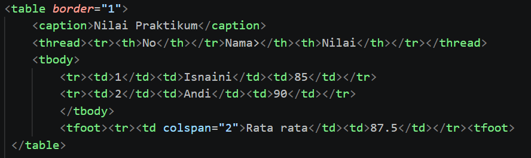
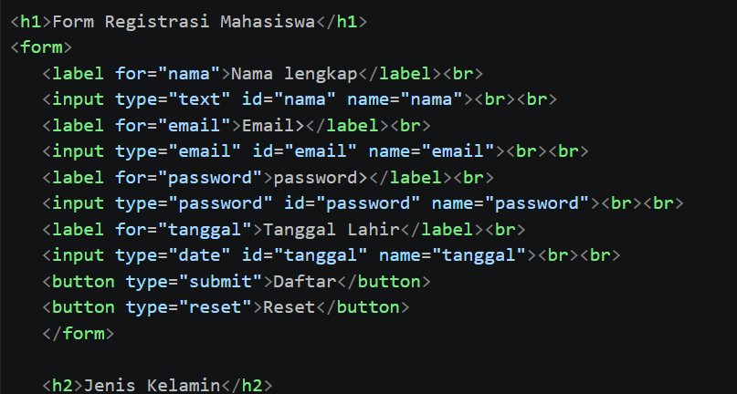
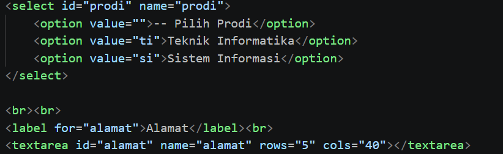
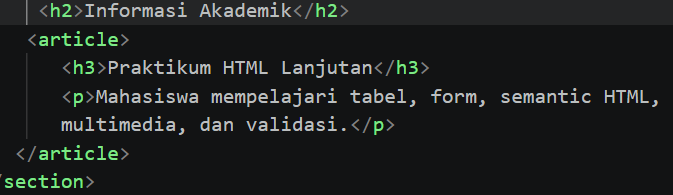
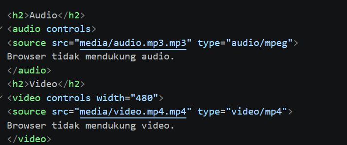
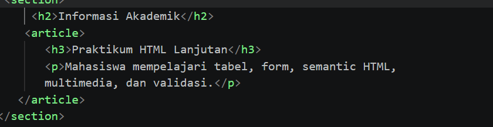
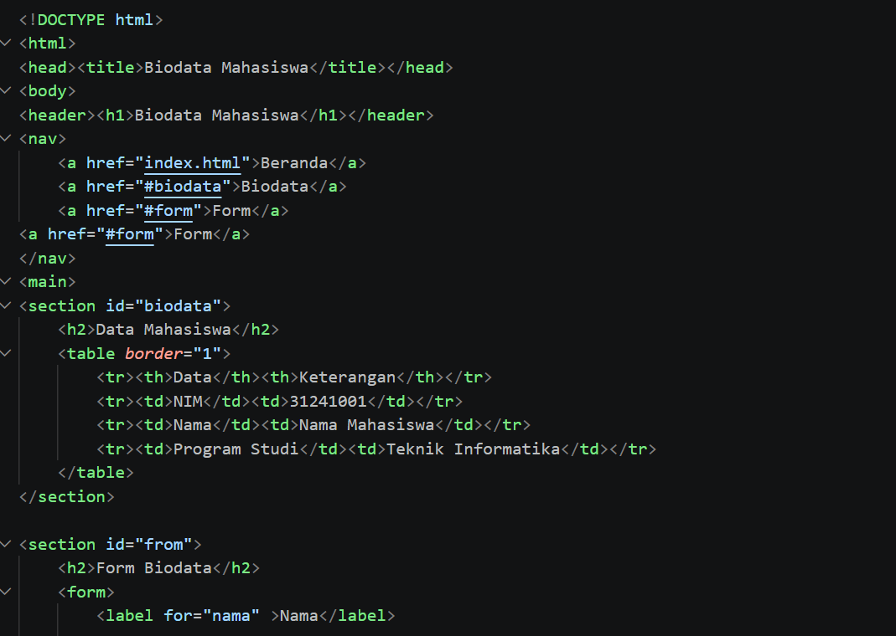
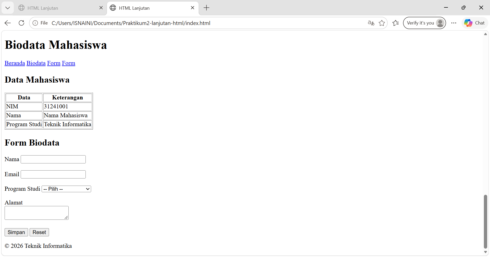
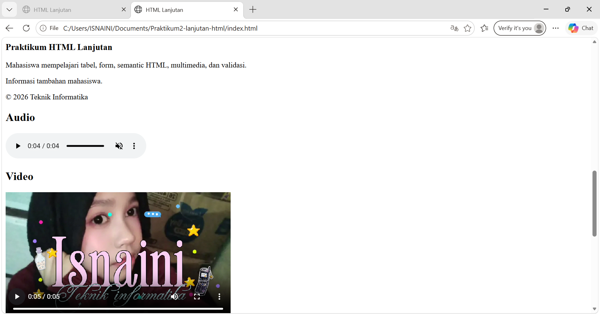

# Lab2Web PRAKTIKUM 2 – HTML LANJUTAN

Nama: [Isnaini]
NIM: [312510380]
Kelas: [I251D]
Program Studi: Teknik Informatika
Universitas: Universitas Pelita Bangsa
Tahun: 2026
# LANGKAH-LANGKAH PRAKTIKUM
## Membuat Tabel Data Mahasiswa
Tabel digunakan untuk menampilkan data mahasiswa dalam bentuk baris dan kolom.

## Struktur Tabel
Tabel kemudian dikembangkan menggunakan caption, thead, tbody, tfoot, dan colspan.

## Membuat Form
Form digunakan untuk menerima input dari pengguna.

## Select dan Textarea
Select digunakan untuk memilih program studi, sedangkan textarea digunakan untuk memasukkan alamat.

## Membuat Halaman Semantic HTML
Semantic HTML digunakan untuk membuat struktur halaman berdasarkan fungsi masing-masing elemen.

## Menambahkan Audio dan Video
HTML menyediakan elemen audio dan video untuk menampilkan multimedia.

## Validasi Form Dasar
Validasi digunakan agar data yang dimasukkan pengguna memenuhi aturan tertentu. Modul menggunakan required, minlength, min, dan max

## PROYEK MINI BIODATA MAHASISWA
Untuk proyek mini, jangan pakai coding buatan saya yang sebelumnya. Gunakan coding yang memang diberikan dalam modul.
Proyek mini menggabungkan semantic structure, tabel data, form, validasi dasar, dan multimedia.
Bagian awal coding sesuai modul:

## hasil proyek

