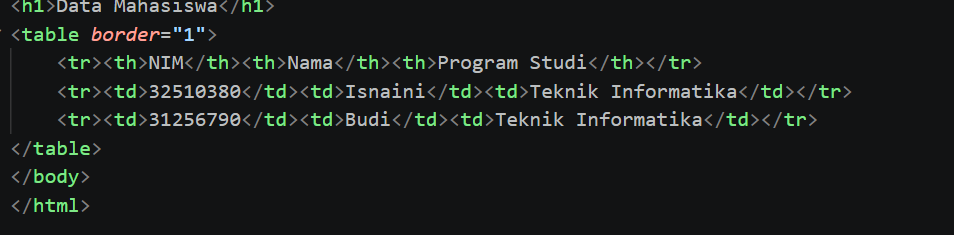

# Lab2Web PRAKTIKUM 2 – HTML LANJUTAN

Nama: [Isnaini]
NIM: [312510380]
Kelas: [I251D]
Program Studi: Teknik Informatika
Universitas: Universitas Pelita Bangsa
Tahun: 2026
# LANGKAH-LANGKAH PRAKTIKUM
## 4.1 Membuat Tabel Data Mahasiswa
Tabel digunakan untuk menampilkan data mahasiswa dalam bentuk baris dan kolom.

